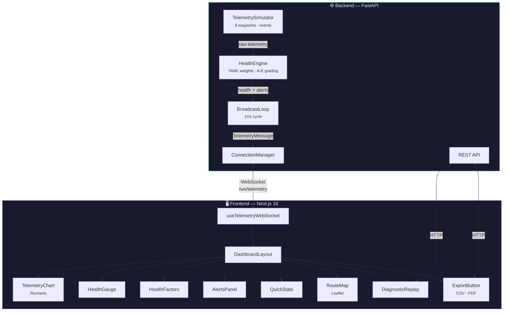

<div align="center">
    <h1>【 КТЖ Digital Twin 】</h1>
    <h3>Visual Digital Twin Dashboard for Locomotive Health Monitoring</h3>
</div>

<div align="center">


</div>

<div align="center">
    <h2>• overview •</h2>
</div>

A real-time locomotive health monitoring dashboard built for **Kazakhstan Temir Zholy (KTZh)** — the national railway company of Kazakhstan. The system simulates telemetry data from a locomotive traveling the **Astana → Almaty** corridor (~1200km, 8 waypoints), computes a composite Health Index (0–100, grades A–E), and streams everything to a live dashboard via WebSocket at 1Hz.

Built for **HackNU 2026** hackathon.

<div align="center">
    <h2>• architecture •</h2>
</div>



<div align="center">
    <h2>• features •</h2>
</div>

### 📡 Real-Time Telemetry Streaming

- 10 monitored parameters: speed, engine temp, brake pressure, fuel level, voltage, vibration, oil pressure, coolant temp, axle load, signal strength
- WebSocket streaming at 1Hz with automatic reconnection
- Simulator generates realistic events — normal operation, gradual degradation, sudden spikes

### 🏥 Composite Health Index

- Weighted scoring engine with YAML-configurable parameters
- Three-tier normalization (optimal → warning → critical)
- Health grades: **A** (Excellent) → **B** (Good) → **C** (Fair) → **D** (Poor) → **E** (Critical)
- Alert penalties automatically lower the score

### 🗺️ Interactive Route Map

- Astana → Almaty corridor with 8 waypoints (Karaganda, Balkhash, Taldykorgan, etc.)
- Animated train marker showing real-time position
- Built with Leaflet + OpenStreetMap tiles

### 🔄 Diagnostic Replay

- Time slider to scrub through telemetry history
- Play/pause playback with adjustable speed
- Snapshot card showing parameter values at any point in time
- Mini sparkline chart for trend visualization

### 📊 Export & Reporting

- CSV download of telemetry history (Blob-based, client-side)
- PDF export via browser print API
- One-click export from the dashboard

### 🚨 Smart Alerts

- Automatic alert generation based on threshold violations
- Warning and critical severity levels
- Real-time alert panel with timestamps and parameter context

<div align="center">
    <h2>• tech stack •</h2>
</div>

| Layer | Technology |
|-------|-----------|
| **Frontend** | Next.js 16, React 19, TypeScript 5.8, Tailwind CSS v4, Recharts, Leaflet |
| **Backend** | FastAPI, Python 3.12, Pydantic v2, YAML config, uvicorn |
| **Real-Time** | WebSocket (1Hz broadcast loop), ConnectionManager |
| **Infrastructure** | Docker Compose, multi-stage builds, standalone output, healthchecks |

> [!TIP]
> 🚀 The frontend uses React 19's latest features with Turbopack for blazing-fast dev builds

<div align="center">
    <h2>• getting started •</h2>
</div>

### Prerequisites

- **Node.js** 22+ & **pnpm**
- **Python** 3.12+ & **uv**
- **Docker** & **Docker Compose** (optional, for containerized setup)

### Backend

```bash
cd backend
uv sync
uv run uvicorn main:app --reload
```

The API will be available at `http://localhost:8000` with interactive docs at `/docs`.

### Frontend

```bash
cd frontend
pnpm install
pnpm dev
```

The dashboard will be available at `http://localhost:3000`.

### Docker (One Command)

```bash
docker compose up --build
```

> [!IMPORTANT]
> Both services start together — the frontend proxies WebSocket connections to the backend automatically.

<div align="center">
    <h2>• project structure •</h2>
</div>

```
hacknu-2026/
├── backend/
│   ├── main.py                    # FastAPI app + broadcast loop
│   ├── app/
│   │   ├── models/telemetry.py    # Pydantic schemas
│   │   ├── services/
│   │   │   ├── simulator.py       # 8-waypoint telemetry generator
│   │   │   ├── health_engine.py   # Weighted health scoring
│   │   │   └── connection_manager.py
│   │   ├── api/                   # REST + WebSocket endpoints
│   │   └── data/health_weights.yaml
│   ├── Dockerfile
│   └── pyproject.toml
├── frontend/
│   ├── src/
│   │   ├── app/                   # Next.js App Router pages
│   │   ├── components/dashboard/  # 12 dashboard components
│   │   ├── hooks/                 # useTelemetryWebSocket
│   │   ├── context/               # Theme provider
│   │   └── lib/                   # Types + constants
│   ├── Dockerfile
│   └── package.json
├── docker-compose.yml
└── README.md
```

<div align="center">
    <h2>• api endpoints •</h2>
</div>

| Method | Endpoint | Description |
|--------|----------|-------------|
| `WS` | `/ws/telemetry` | Real-time telemetry stream (1Hz) |
| `GET` | `/api/telemetry/current` | Latest telemetry snapshot |
| `GET` | `/api/telemetry/history` | Historical telemetry buffer |
| `GET` | `/api/alerts` | Active alerts list |
| `GET` | `/api/health/config` | Health engine weights config |
| `GET` | `/health` | Service health + uptime |

> [!IMPORTANT]
> This project was crafted with ✨ love and railway passion ✨ for HackNU 2026

<div align="center">

  🚂 【 Happy Monitoring! 】👾

</div>
